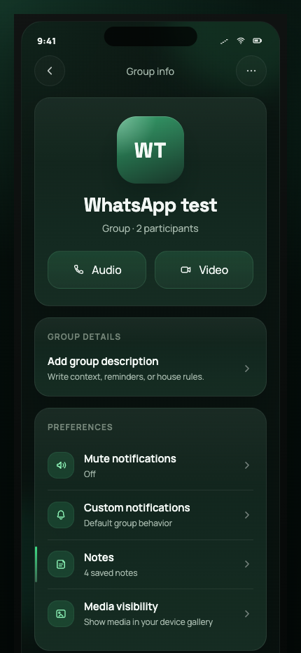
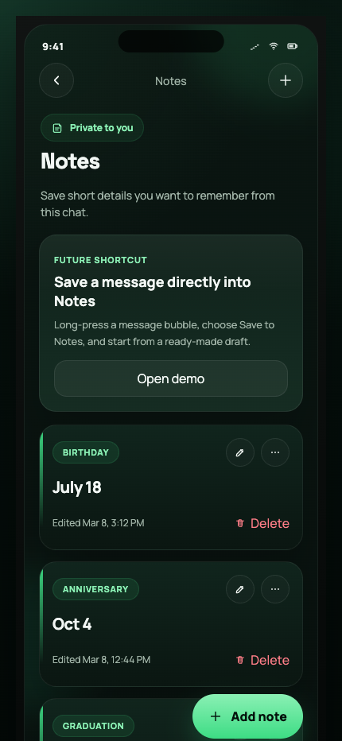

# Notes Messaging Prototype

React prototype for a private "Chat Notes" feature presented inside an original dark-mode messaging app mockup. This repository is intended as a product, design, and engineering review artifact rather than a production messaging client.

## Repository Scope

- Original UI implementation built for feature exploration and internal review.
- Mobile-sized prototype focused on a chat relationship memory feature.
- Includes a group info entry point, notes list, add/edit note flow, and a future-facing "Save to Notes" interaction demo.
- Does not use or claim to use WhatsApp source code.

## Screenshots

<p align="center">
  
  
</p>

## Run Locally

```bash
npm install
npm run dev
```

Open the local Vite URL printed in the terminal, typically `http://127.0.0.1:5173/`.

## Build for Review

```bash
npm run build
```

## Component Structure

- `src/App.jsx` keeps screen navigation, note CRUD state, and the shared modal and toast behavior.
- `src/components/GroupInfoScreen.jsx` renders the info page with the inserted `Notes` row between custom notifications and media visibility.
- `src/components/NotesScreen.jsx` shows the dedicated notes list, add button, and editable note cards.
- `src/components/NoteEditorModal.jsx` handles add and edit note entry with label chips and the 240-character limit.
- `src/components/SaveToNotesDemo.jsx` demonstrates the future long-press "Save to Notes" chat action.

## Developer Handoff Brief

### Feature Summary

- Feature: Chat Notes
- Product Area: Chat, Contact Info, Group Info
- Platform: iOS and Android with parity expected across both
- Visibility: Private to the current user only

### Overview

Users often want to remember small personal details about contacts or groups, such as birthdays, anniversaries, milestones, preferences, and family facts. In current messaging behavior, people usually work around this by starring messages or sending reminders to themselves, but those patterns do not attach the information to the specific relationship context.

The proposed Notes feature allows users to save short private notes tied to a specific chat or group. These notes are intended for lightweight reminders such as birthdays, anniversaries, graduation dates, favorite things, and other meaningful details.

### Product Goals

#### Primary Goal

Allow users to store small contextual facts about people or groups directly within the chat relationship layer.

#### Secondary Goals

- Reduce friction when recalling personal details.
- Provide a lightweight memory tool without turning the product into a full note-taking app.
- Improve relationship continuity across long chat histories.

### Non-Goals

The Notes feature will not:

- Replace full note-taking apps.
- Allow collaborative note editing.
- Be visible to other chat participants.
- Store large content such as images, files, or long-form text.
- Replace starred messages.

### Feature Placement

#### Entry Point

The main entry point is the Chat Info or Group Info screen.

Placement order:

1. Mute notifications
2. Custom notifications
3. Notes
4. Media visibility

### UI Specification

#### Row in Chat Info

- Title: `Notes`
- Subtitle, empty state: `Save important details from this chat`
- Subtitle, populated state: `3 saved notes`
- Interaction: tap opens the Notes screen

#### Notes Screen

- Header: `Notes`
- Description: `Save short details you want to remember from this chat.`
- Primary elements:
  - Add Note button
  - List of saved notes
  - Edit and Delete actions

#### Empty State

- Title: `Remember the little things`
- Text: `Save birthdays, anniversaries, names, and other details from this chat.`
- CTA: `Add note`

### Data Model

Each note object is expected to follow this shape:

```ts
type Note = {
  id: string;
  chat_id: string;
  owner_user_id: string;
  text: string; // max 240 characters
  label?: string;
  created_at: string;
  updated_at: string;
};
```

Constraints:

- Maximum characters per note: 240
- Maximum notes per chat: 50 as a soft limit

Example notes:

- Birthday — July 18
- Anniversary — Oct 4
- Graduation — May 2027
- Personal — Loves bread pudding

### Add Note Flow

User taps Add Note and opens a screen or modal containing:

- Note text field, required
- Optional label selector
- Character counter
- Cancel and Save actions

Suggested labels:

- Birthday
- Anniversary
- Family
- School
- Favorites
- Personal
- Custom

Validation:

- Save is disabled when the note is empty.
- Save is disabled when the note exceeds 240 characters.

### Edit Note Flow

When a user taps an existing note, the edit experience opens with fields prefilled.

Actions:

- Save changes
- Delete note

### Interaction Behavior

| Action | Result |
| --- | --- |
| Add note | Appears in the notes list |
| Edit note | Updates the note timestamp |
| Delete note | Removes the note immediately |
| Reach 240 characters | Additional input is blocked |

### Privacy

Notes are:

- Visible only to the current user
- Not synced to other chat participants
- Not visible in exported chats
- Not visible in backups shared with other users

Notes are expected to sync across the user’s own devices through account-level sync.

### Storage

Recommended storage shape:

Client-side table:

- `note_id`
- `chat_id`
- `user_id`
- `note_text`
- `note_label`
- `created_timestamp`
- `updated_timestamp`

Server-side recommendation:

- Encrypted user metadata store

Notes should be modeled as end-to-end-encryption-safe user metadata rather than shared conversation data.

### Optional Future Enhancements

- Save to Notes from chat via long-press on a message
- Birthday reminders
- Anniversary reminders
- Pinned notes
- Search within notes
- Smart suggestions when a message looks like a memorable personal detail

Example suggestion:

`July 18 is my birthday` → `Save to Notes?`

### Edge Cases

- If the chat is deleted, all notes tied to that chat are deleted.
- If a contact changes number, notes persist through the chat ID.
- If the group is removed, notes are deleted.
- If the user leaves the group, notes are removed locally.

### Performance Considerations

- Expected average notes per chat: 1 to 5
- Worst case per chat: 50
- Storage impact should remain minimal

### Security

Notes should be:

- Encrypted in transit
- Encrypted at rest
- Tied to the authenticated user ID
- Excluded from other users’ data views

### Metrics

Track:

- Notes created per chat
- Notes opened from the info screen
- Notes edited
- Retention of notes after 30 days

Success metric:

- Increase in relationship context recall actions

### QA Checklist

Test:

- Character limit enforcement
- Add, edit, and delete flows
- Empty state rendering
- Sync across devices
- Chat deletion cleanup
- Performance with 50 notes
- Dark and light theme presentation

### Engineering Estimate

- UI complexity: low to medium
- Backend complexity: low
- Sync complexity: medium
- Estimated sprint cost: 3 to 5 weeks


